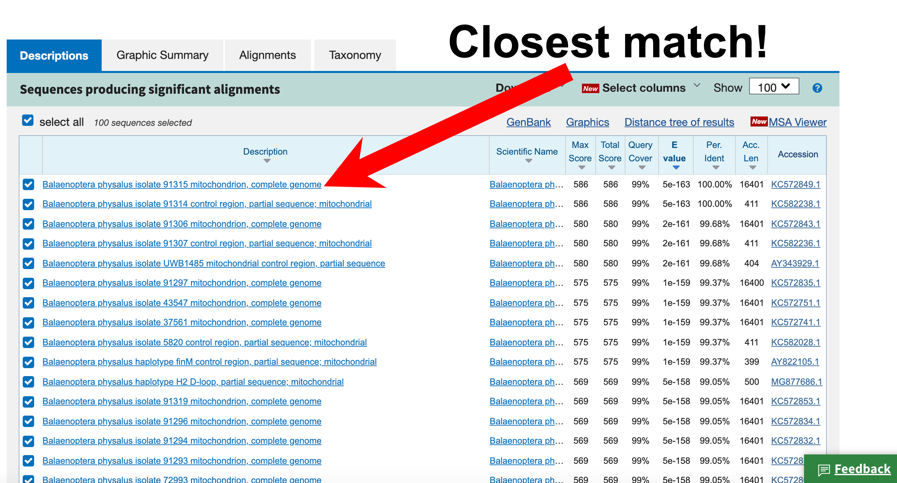

# What whale is that?
- [Why do we need to identify whale samples with DNA?](index.md#why-do-we-need-to-identify-whale-samples-with-DNA)  
- [Why do we use mitochondrial DNA?](index.md#why-do-we-use-mitochondrial-dna)
- [Things this exercise should teach](index.md#things-this-exercise-should-teach)    
- [I don't want to read all of this - let me go straight to the exercise!](index.md#identifying-whale-meat-with-dna)  
- [What whales were they and when does this approach not work so well?](index.md#what-whales-were-they-and-when-does-this-approach-not-work-so-well)  
- [Acknowledgements](index.md#acknowledgements)  

## Why do we need to identify whale samples with DNA?
Cetaceans (whales and dolphins) are super diverse and (mostly - with the exception of some dolphin and beaked whale species) easy to tell apart based on morphology (a fancy word for "their appearance") because natural selection and drift have acted to make some very different looking critters. Here's just a few of the ~90 cetacean species!

Given they look so different, why would we ever need to identify species with DNA?  

Well...how about these whales and dolphins? Can you tell them apart?  

Sometimes we can get samples that no longer look like the original dolphin or whale. This might be because the animal has been dead for a while (e.g. strandings) and no longer looks like it did while alive (this happens quite a bit in Aotearoa New Zealand!). Sometimes it might be because the animal has been cut up for food like in the whale meat example above. Sometimes it is because we recover bones from old whaling stations and we don't know what species they belong to anymore. In these cases, sometimes using DNA can help us figure out what species we have.  

Often, we use a kind of DNA called mitochondrial DNA, often known as mtDNA for short. More on that in the next section!

[*back to the top*](index.md#what-whale-is-that)  

## Why do we use mitochondrial DNA?
Most of the time when we think about "DNA", we think of nuclear DNA, which is found in the nucleus in our chromosomes.  

This kind of DNA is biparental - you get one copy from your mum, and one copy from your dad. This "double-copy" kind of DNA is known as diploid DNA.  

However, there are other kinds of DNA and one that is particularly handy for forensic identification of species is mitochondrial DNA or mtDNA. Unlike nuclear DNA, mitochondrial DNA is only inherited from your mum, which means almost everyone has the same kind of mtDNA as their biological mum. This "single-copy" kind of DNA is known as haploid.

The mtDNA hangs out inside mitochondria, the powerhouse of the cell. Some genes in the mitochondrial DNA encode for proteins. However, for our analyses we mostly use a specific locus - the control region - because it doesn't appear to be under as strong selection as the parts of the mtDNA that code for proteins.  

Why is this important? Well, we know that the ultimate origin of all genetic variation is mutation. One of the reasons we particularly like to work with mtDNA is that it has a higher mutation rate, which means it accumulates variation more quickly than nuclear DNA.

But the control region is extra special. Because mutations in this locus are mostly neutral, they don't get removed from the population because of purifying/negative selection. Over time, this means that a bunch of mutations can build up that can distinguish different maternal lineages (kind of like a maternally-inherited surname). When we define certain stretches of DNA based on the mutations they hold, this is called 'haplotyping'.

Over time, processes like natural selection, bottlenecks and genetic drift mean we can even use mtDNA to distinguish different species!

Not only can the mtDNA distinguish different species, but it is also present in multiple copies per cell (because your cells have lots of mitochondria to power them, and each mitochondria has copies of mtDNA). Because there are lots of copies, it means that we are more likely to be able to successfully extract mtDNA and amplify the control region using PCR, even from samples that are degraded... like animals that have been decomposing on the beach for a while, or whale meat that has been canned, or a bleached bone that has been sitting at a whaling station for centuries.

[*back to the top*](index.md#what-whale-is-that)  

## Things this exercise should teach
This exercise touches on aspects of NCEA Level 2 and 3 Biology, including *2.5 Genetic variation and change (AS 91157)* (particularly 'sources of genetic variation' and 'genetic change') and *3.5 Demonstrate understanding of evolutionary processes leading to speciation* (particularly 'mechanisms of evolution', 'the origin of species', and 'patterns of evolution'). It has also been used for non-genetics majors at university.

[*back to the top*](index.md#what-whale-is-that)  

## Identifying whale meat with DNA  
In response to the near-commercial extinction of many of the 'great whale' species, a moratorium on commercial whaling came into place in 1986. However, some countries continued to capture whales as 'bycatch' in fishing gear or through scientific whaling schemes. In addition, there have been occasional instances of illegal international trade of whale meat, where it has even ended up in [high end restaurants!](https://www.wired.com/2010/04/whale-meat-bust/)  

Because of the lack of oversight over which species were being sold in whale meat markets, some plucky scientists including Prof. Scott Baker from Oregon State University, packed up a PCR machine in their suitcases and headed to the markets, where they amplified the control region of the mtDNA from multiple whale meat products in their hotel rooms! Following sequencing, the species that the whale meat samples were from could be identified. There is more info [here](https://mmi.oregonstate.edu/ccgl/research-projects/monitoring-whaling-trade-endangered-species) if you are interested! 

In this exercise, we'll pick up just after the samples have been amplified and sequenced to figure out **What whale is that?** based on the stretches of A, C, G and Ts that make up the control region of the mtDNA of these samples. We'll be using two methods:  
1. [BLAST](index.md#using-blast), which relies on comparing the similarity between our sequences and whale and dolphin sequences in a database; and 
2. [Witness for the whales](index.md#using-witness-for-the-whales), a phylogenetic (tree-based) method that uses expertly-curated sequences.

The samples we'll be identifying are [here](whale_meat_sample_sequences.md) (open it in a new tab so you can flick back and forth with the instructions), and the instructions for how to figure out what species they are with the two methods are below. Keep a pen and paper handy, or a file open on your device, so you can write down your species IDs!

[*back to the top*](index.md#what-whale-is-that)  

### Using BLAST
1. Head to the website https://blast.ncbi.nlm.nih.gov/Blast.cgi?PROGRAM=blastn&PAGE_TYPE=BlastSearch&LINK_LOC=blasthome (copy and paste the link so you don't have to type it out manually!)
2. Copy the first sequence from our [whale meat samples](whale_meat_sample_sequences.md)
3. Paste this into the BLAST data entry window, and then click ‘BLAST’ at the bottom of the window

4. After it spits back the results page, scroll down to the 'Sequences producing significant alignments' section to see the species BLAST has found to have the greatest overall similarity to our sample. 

5. If you want to find the common name, check out [this key](DNA_surveillance_database_species.pdf)

6. You’ve identified your whale meat sample species ID, nice work!!!!

[*back to the top*](index.md#what-whale-is-that)  

### Using 'Witness for the Whales'
1. Head to the website http://www.dna-surveillance.auckland.ac.nz/page/whales/title (copy and paste the link so you don't have to type it out manually!)
2. Copy the first sequence from our [whale meat samples](whale_meat_sample_sequences.md)
3. Click Cluster (Simple), and paste your sequence into the data entry window:

4. Select your database. You will start off with “All cetaceans Vs 4.3”. Make sure you are selecting “Ctrl”  because “control region” is the kind of the DNA we are looking at today. Scroll to the bottom and hit “submit”!
5. Find out whether your sample is in the “MYSTICETE” or “ODONTOCETE” dataset by looking at [the key](DNA_surveillance_database_species.pdf). You will then follow  steps 2-4, but select either MYSTICETE or ODONTOCETE as your database (you should be able to hit "back" on your browser, and hopefully your sequence will still be there). For example, in the first search our user sample is nearby a fin whale, a humpback whale, and a blue whale in the tree:

If we head to [the key](DNA_surveillance_database_species.pdf), we see that all of these species are within 'MYSTICETE':

We'll then hit the back button and select 'Mysticetes v4.3' as our database.

**Why** do we have to do such a complicated dance? The “higher level” databases e.g. “All cetaceans” we don’t always have all the species (because the program would run too slow) so that’s why we zoom into Mysticete and Odontocete databases – and sometimes even further!!!
6. On the next run-through, we find that our sample appears to be a fin whale. To find the closest relative in a phylogenetic tree, follow the line back from yoru sample of interest until you hit a perpendicular line. That perpendicular line will attach to the closest relative of your sample/species.

7. Nice work, you've identified your sample using a phylogenetic method. Although this might seem a bit more complicated, hopefully by the end of the exercise you might see why this can be a handy approach.

[*back to the top*](index.md#what-whale-is-that)  

## What whales were they and when does this approach not work so well?
Have a peek [here](answer_key.md) to see what our samples were, and for a discussion of when it might not work out to use mtDNA to forensically identify species.

[*back to the top*](index.md#what-whale-is-that) 

## Acknowledgements
This exercise was originally developed by [Prof. Scott Baker](https://mmi.oregonstate.edu/people/c-scott-baker). While Alana was based in Scott's lab for her PhD research, she has gradually tweaked the materials, but the images of the whale meat samples within the exercises and their DNA sequences are from Scott. Ngā mihi e hoa!  

All images on this page developed by Alana, with the exception of the collage of cetacean species (LittleJerry, CC BY-SA 4.0, https://commons.wikimedia.org/wiki/File:The_Cetacea.jpg)

[*back to the top*](index.md#what-whale-is-that) 
